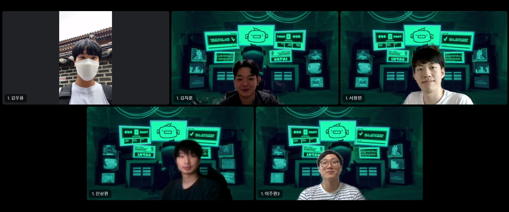

## 팀 구성원

---

+ [팀장] 김치훈, 김우용, 서창민, 신상원, 이주원3

## 회고 내용 요약 (최소 500자 이상)

---

### Infra

**1.도커**

+ Docker는 애플리케이션을 신속하게 구축, 테스트 및 배포할 수 있는 소프트웨어 플랫폼
+ 도커를 통해 OS를 공유, 격리화하여 관리할 수 있다.

+ 도커는 Dockerfile을 이용해 파일을 이미지로 만듦

**2. 이미지**

+ 컨테이너 실행에 필요한 파일과 설정을 포함하고 있는 것으로 상태값을 가지지 않고 변하지 않음.


**3. 컨테이너**

+ 어플리케이션과 애플리케이션이 동작하기 위해 필요한 라이브러리나 모듈 등을 묶어준 것. 


**4. 명령어 정리**

```shell
# 컨테이너 삭제
docker rm -f $(docker ps -qa)

# 이미지 삭제
docker rmi -f $(docker images -qa)

# 안쓰는 네트워크 삭제
docker network prune -f

# 안쓰는 볼륨 삭제
docker volume prune -f

# 도커 프로젝트 삭제
sudo rm -rf /docker/projects
sudo rm -rf /docker_projects

# 이미지 목록 보기
docker images

# 이미지 검색
docker search [이미지 이름]

# 이미지 받기
docker pull [이미지 이름]:[태그] 

# 이미지 삭제
docker rmi [이미지 id]

# 컨테이너 자세히 조회
docker inspect [도커 id]

# 컨테이너 삭제
docker rm -f [도커 id]

# 현재 실행중인 프로세스 조회
docker ps
```


### SPRING 

**1. Redis**

+ key-value 구조의 비 관계형 DB

+ 여러 자료구조를 지원하며 대표적으로 String, Set, Sorted Set, Hash, List 등 지원

+ in-memory 형태의 No-SQL로써 key-value 쌍의 해쉬 맵 형태의 데이터 베이스

+ 메모리와 디스크에 저장되기 때문에 데이터 복구 가능

  

**2. Web Cache**

+ 서버 지연을 줄이기 위해 리소스들을 임시 저장하는 기술

+ 개발자 도구에서 캐시 설정 확인 가능


**3. 접근 제한**

+ @PreAuthorize("isAnonymous()") : 로그인하지 않은 상태여도 접근 가능

+ @AuthenticationPrincipal : Principal에서 조회 할 수 있는 정보는 name밖에 없음

  => @AuthenticationPrincipal을 통해 정보를 가져와야한다.

```java
@GetMapping("/currentUser")
    @ResponseBody
    public MemberContext currentUser(@AuthenticationPrincipal MemberContext memberContext) {
        return memberContext;
    }
```


**4. OAuth**

+ 다양한 플랫폼 환경에서 권한 부여를 위한 산업 표준 프로토콜 간단하게 인증(Authentication)과 권한(Authorization)을 획득하는 것

  + 인증 : 시스템 접근을 확인

  + 권한 : 권리를 검증

+ 카카오 로그인 API 사용하기

  1. 카카오 디벨로퍼에 앱 등록
  2. 카카오에 리다이렉트 URL 설정
  3. yml파일에 kakao client Id 작성


## 회고 과정에서 나왔던 질문 (최소 200자 이상)

---

+ 파일 업로드시 MultipartFile 클래스도 DTO 안에 넣어서 DTO로 받으려고 했는데 실패했다. 안 되는 것인가?

  => MultipartFile 클래스는 DTO안의 값으로 쓸 수 있다. 단순 오타로 인해서 실패했음

+ --rm 옵션은 왜 사용하는가?

  => 프로세스를 종료하고 새로운 컨테이너를 만들 때, 기존 종료된 컨테이너가 남아있고, 계속 쌓이게 되기 때문에

  => 실행 시에는 아무 영향이 없고, 컨테이너 종료 시에만 작동된다.


## 회고 인증샷 & 팀 자랑

---



- 질문 사항이 있으면 서로 질문을 하고 참고자료를 찾습니다.😊
  - 개념적 부분에서 빠진 내용이 있으면 알차게 채워집니다!😊
